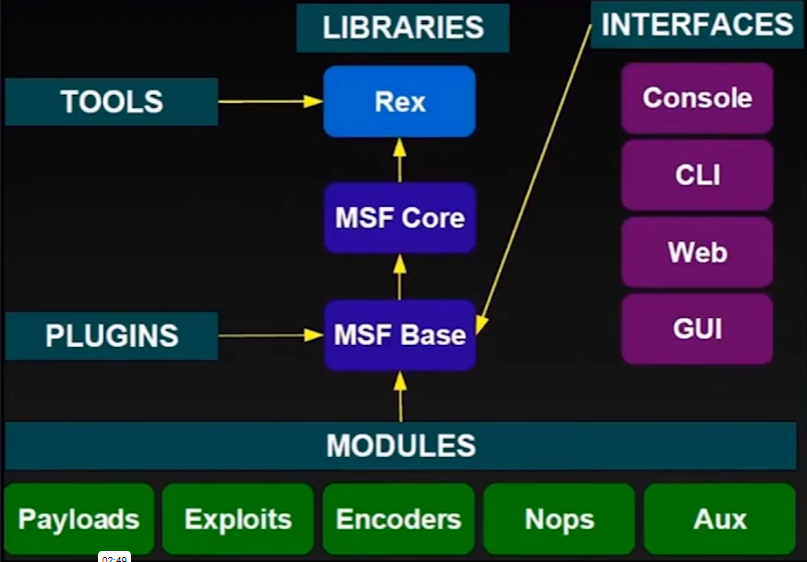

## METASPLOIT FRAMEWORK TODO EN UNO

Metasploit Framework es una plataforma de código abierto que proporciona una colección de herramientas y recursos para llevar a cabo pruebas de penetración y explotación de sistemas informáticos.

Esta funciona al permitir a los usuarios buscar, desarrollar y ejecutar exploits contra sistemas objetivo para probar su seguridad. Los exploits son programas o scripts diseñados para aprovechar vulnerabilidades conocidas en software o sistemas operativos. Metasploit Framework proporciona una interfaz de línea de comandos y una interfaz gráfica de usuario (llamada msfconsole) que permiten a los usuarios interactuar con la plataforma y realizar acciones como buscar exploits, seleccionar payloads, configurar opciones y ejecutar ataques.

## ARQUITECTURA DE METASPLOIT FRAMEWORK

**MSF BASE**

- **Plugins:** Son componentes adicionales que extienden la funcionalidad de Metasploit Framework, permitiendo agregar nuevas características o integraciones.
- **Interfaces:** Son las diferentes formas en que los usuarios pueden interactuar con Metasploit Framework. Esto incluye la interfaz de línea de comandos (CLI), la consola de Metasploit (msfconsole), la interfaz gráfica de usuario (GUI) y la interfaz web.
- **Módulos:** Son los componentes principales de Metasploit Framework que se utilizan para realizar acciones específicas durante una prueba de penetración. Los módulos incluyen:
  - **Payloads:** Fragmentos de código que se ejecutan después de que un exploit ha tenido éxito y proporcionan funcionalidades específicas en el sistema comprometido. Los payloads pueden incluir acciones como proporcionar acceso remoto al sistema, ejecutar comandos, recopilar información del sistema, entre otros.
  - **Exploits:** Módulos que aprovechan vulnerabilidades conocidas en software o sistemas operativos para comprometer sistemas objetivo. Cada exploit está diseñado para explotar una vulnerabilidad específica y puede incluir código que permite ejecutar comandos arbitrarios en el sistema objetivo.
  - **Encoders:** Módulos utilizados para cifrar o codificar payloads con el fin de evadir la detección de antivirus o intrusiones. Los encoders pueden convertir un payload en una forma diferente que sea más difícil de detectar por los sistemas de seguridad.
  - **Nops:** Abreviatura de "no operations", son módulos utilizados para agregar relleno adicional a los exploits o payloads. Esto puede ser útil para alinear la memoria o ajustar la longitud del exploit para que funcione correctamente en el sistema objetivo.
  - **Auxiliares:** Proporcionan funcionalidades adicionales que pueden ser útiles durante una prueba de penetración, pero no están directamente relacionadas con la explotación de vulnerabilidades. Estos módulos pueden incluir herramientas de escaneo de red, explotación de debilidades de configuración, enumeración de servicios, entre otros.

**MSF CORE**

Este es el núcleo de Metasploit Framework que proporciona la funcionalidad esencial para la ejecución de exploits, payloads y otros módulos. Es responsable de coordinar las acciones de los módulos y proporcionar la infraestructura necesaria para ejecutar pruebas de penetración de manera efectiva.

**REX**

Es un marco de trabajo (framework) dentro de Metasploit que se utiliza para el desarrollo de herramientas y scripts personalizados. Proporciona una serie de herramientas y bibliotecas (librareis) que los usuarios pueden utilizar para automatizar tareas específicas durante una prueba de penetración.

- **Herramientas:** Son las herramientas específicas que forman parte del marco Rex y se utilizan para realizar acciones concretas durante una prueba de penetración.
- **Librerías:** Son las bibliotecas de funciones y utilidades que proporcionan funcionalidades adicionales para el desarrollo de herramientas y scripts personalizados en Metasploit.  

[PRACTICA INTERACCION BASICA METASPLOIT](../laboratorio/metasploit-lab.md#laboratorio-1-interaccion-basica)

