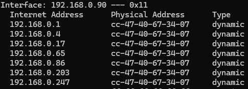
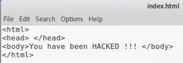
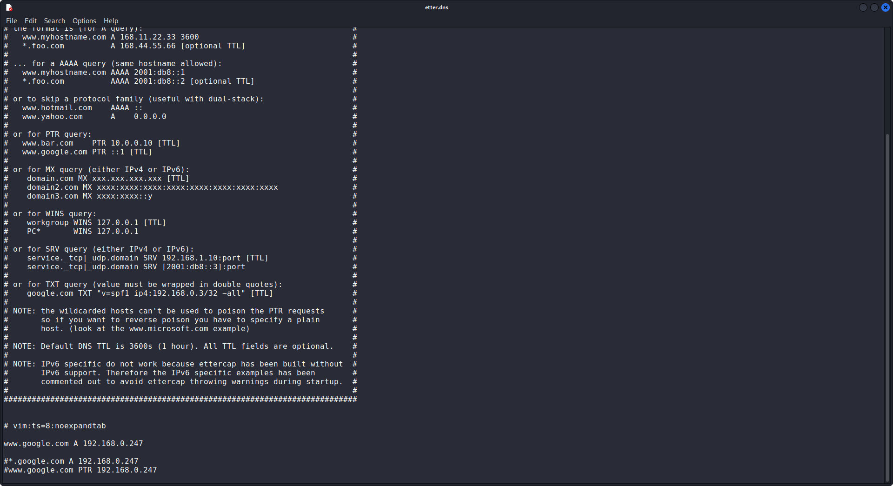

## LABORATORIO 1 (MAN IN THE MIDDLE)

1. En la maquina Windows ejecutaremos **_ipconfig_** para obtener la Default Gateway

2. Y posteriormente ejecutamos **_arp -a_** para obtener la Physical Addres/MAC de esta misma ip antes deseada

3. En Kali abrimos una terminal y ejecutamos **_ifconfig_** para obtener nuestra MAC la cual está marcada como **ether cc:47:40:67:34:07**
4. Abrimos en Kali la aplicación ettercap y en **Aceptar/Iniciar** arriba a la derecha para ejecutarla
5. Escaneamos los hosts en la opción superior izquierda (**SCAN FOR HOSTS**)
6. Abrimos la lista de anfitriones en la opción superior izquierda (**HOSTS LIST**)
7. Vemos nuestra maquina objetivo Windows en la lista con la ip 192.168.0.90
8. La seleccionamos, clic derecho y **Add Target 1**
9. Nos vamos al menú MITM arriba a la derecha (**MITM MENU**) y seleccionamos **ARP POISONING**
10. Marcamos solo para esta práctica la opción **ONLY POISON ONE-WAY** y **OK**
11. Verificamos el falso ARP enviado a la maquina objetivo Windows y en la CMD ejecutamos de nuevo **arp -a**
12. Veremos como ahora la mayoría de las direcciones físicas están sustituidas por la MAC de nuestra maquina atacante Kali, pero la importante es la puerta de enlace 192.168.0.1

13. Comprobado esto nos iremos a Wireshark en nuestra maquina Kali y comenzamos a capturar paquetes
14. Nos vamos a la maquina Windows víctima, abrimos el navegador y simplemente nos vamos a [www.google.com](http://www.google.com)
15. En Wireshark aplicamos el filtro **ip.src==&lt;ip objetivo&gt;**

16. Y de esta forma podremos ver las Query o paquetes enviados desde la maquina victima Windows.

## LABORATORIO 2 (DNS SPOOFING)

1. En la terminal de Kali ejecutaremos **_cd /var/www/html/_** y listamos con **_ls_**
2. Copiaremos el documento html original ahí mismo con otro nombre ejecutando:  
**_cp index.html index_old.html_**

3. Abrimos el archive index.html con: **_leafpad index.html_**
4. Borramos el contenido completo y haremos una página html muy sencilla para esta prueba y la guardamos

5. Para que esto funcione debemos hacer unas modificaciones antes a los 2 archivos de ettercap pues será esta la aplicación a usar en esta prueba, los dos archivos son **etter.conf** y **etter.dns**, para esto los tenemos que localizar con **_locate etter.conf_** (si no te aparece nada recuerda ejecutar **_updatedb_** para actualizar la base de datos de los documentos en la máquina, pues aquí se guardan las ubicaciones de todos los documentos de esta)
6. Ya mostrada la ubicación del documento lo abriremos:  
**_leafpad /etc/ettercap/etter.conf_**

7. Estos 2 valores debemos marcarlos en 0 y guardar (**uid y gid**)

8. Ahora localizamos el archivo **etter.dns** y lo abrimos con leafpad, igual que el anterior.
9. Y en la última línea del documento para esta práctica agregaremos lo siguiente y lo guardaremos:  
(En esta práctica solamente la línea: [**_www.google.com_**](http://www.google.com) **_A (IP Maquina Kali)_**)

10. Levantamos el servidor apache para que se puedan conectar a nuestra ip y muestre nuestro documento **index.html** antes modificado:  
**_service apache2 start_**

11. Si nos vamos a nuestro navegador web en Kali y ponemos la Ip de nuestra misma maquina Kali deberíamos de ver la página simple que acabamos de crear.
12. Ya todo configurado antes y funcionando nuestro servidor local abriremos Ettercap, iniciaremos, escanearemos los hosts, mostraremos los hosts, seleccionaremos la ip de la maquina objetivo Windows y la agregaremos a Target 1
13. Nos iremos al menú de MITM, ARP Poisoning, marcamos la opción **_Sniff Remote Connections_** y Ok
14. Nos iremos a las opciones de ettercap arriba a la derecha (**Ettercap Menu**) y seleccionaremos **plugins** y **Manage Plugins**
15. Daremos doble clic en **dns_spoof** y ya se ejecutará nuestro spoofing a la maquina objetivo
16. Ahora en nuestra maquina objetivo Windows abriremos el navegador y de preferencia abrir una ventana en incognito o privada para que al buscar no tengamos cache de nuestras consultas anteriores de DNS porque nos dará problemas.
17. Y vamos a ingresar el DNS exacto que antes agregamos como objetivo para el Spoof que es [www.google.com](http://www.google.com) exactamente tal cual lo pusimos en el archivo **etter.dns**
18. Y podremos ver que hemos sido cambiados a la página que nosotros hicimos, pero manteniendo en la barra de búsqueda el DNS google.com

EXTRAS

- El uso de la letra **A** se utiliza para redireccionar un nombre de dominio a una dirección IP especifica que fue la que hicimos de [www.google.com](http://www.google.com) A 192.168.0.247(IP Local). **DNS EXACTA**
- El asterisco (\*) inicial se utiliza como comodín para representar cualquier nombre de dominio. Cuando se coloca al principio de una línea seguido de un espacio, indica que esta configuración se aplicara a todos los nombres de dominio que no coincidan con otras entradas en el archivo. **MULTIPLES DNS RELEVANTES**
- El PTR se utiliza para mapear direcciones IP a nombres de dominio en lugar de mapear nombres de dominio a direcciones IP como lo hacen la mayoría de las consultas DNS. **CONSULTA INVERTIDA**
- **HAY QUE RECORDAR** que este tipo de ataque puede ser mitigado en la capa de transporte o aplicación al realizar una validación de extremo a extremo como TLS y Firmas Digitales por lo que el navegador verifica si el certificado digital del servidor es válido antes de establecer una conexión por lo que esto solo funcionara en sitios web que no utilizan encriptación.

## LABORATORIO 3 (ATAQUES DOS y DDOS)

1. Abrimos la aplicación ETTERCAP e Iniciamos
2. Vamos al menú de Plugins y seleccionamos **DOS_ATTACK**
3. Ingresamos a IP Objetivo y volvemos a ingresar la misma IP Objetivo
4. Se comenzará a atacar a la maquina objetivo
