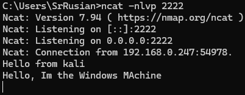

## LABORATORIO 1 (INTERACCION BASICA)

1. Abrimos Wireshark
2. Filtramos las interfaces (Usaremos solo Wireless esta vez)
3. Iniciamos la captura de paquetes en la red 
4. En la pantalla superior se observa el tráfico de datos en la red basado en el filtro que antes aplicamos.
5. En otra maquina con WINDOWS debemos instalar netcat, para eso instalaremos [Nmap](https://nmap.org/download#windows) y lo instalaremos en la máquina.
6. Abrimos su CMD y ejecutamos **_ncat -nlvp 2222_** (2222 es el puerto que usaremos)
7. En Kali abriremos la terminal y ejecutaremos nc -nv (la ip de la maquina objetivo) (su puerto) en este ejemplo el mio es (**_nc -nv 192.168.0.90 2222_**)
8. Escribimos un mensaje y damos enter
9. El mensaje lo debemos recibir en la CMD de nuestra maquina WINDOWS

10. Regresamos a Wireshark y lo detenemos 
11. En la barra inferior del botón de detener que dice **_Apply a display filter…_** aplicamos el filtro **_tcp_**)
12. Tendremos varios resultados de los cuales el primero es el HANDSHAKE o inicio de la conexión de la maquina Kali con la Windows.

El siguiente es un mensaje de que la conexión se ha hecho el cual va desde la maquina Windows hacia Kali.

Posteriormente el tercer paquete debería ser el primer mensaje el cual enviamos desde kali.

1. Seleccionaremos el paquete que creemos es que se mandó el texto plano y con clic derecho nos vamos a **_Follow>TCP Stream_**
2. Podremos ver el resultado final que sucedió en esta conexión el cual será el mensaje o mensajes enviados de una a otra máquina.
