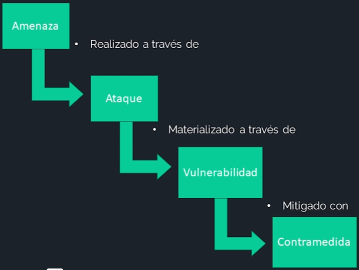
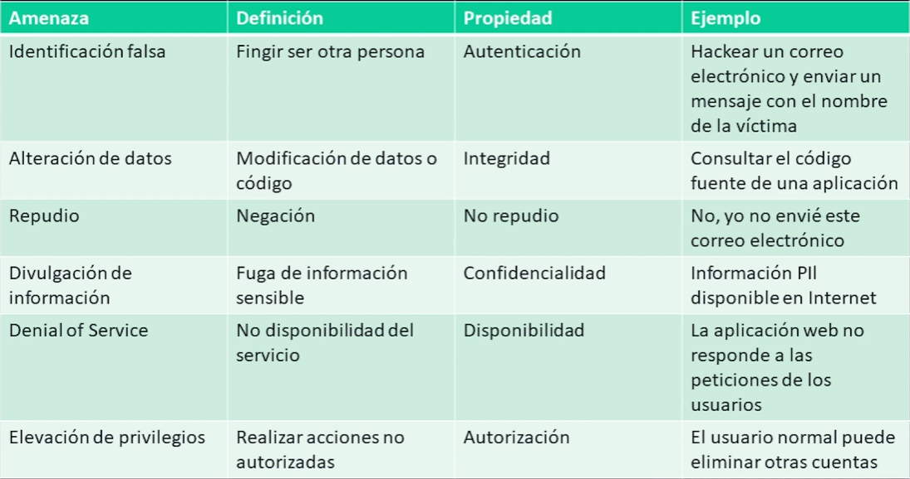

# 4\. PASOS PARA PLANIFICAR CON ÉXITO UNA PRUEBA DE PENETRACION

**4.1.MODELIZACION DE AMENAZAS**

**4.1.1. ¿POR QUE EL MODELADO DE AMENAZAS?**

- Identificar, investigar y clasificar las amenazas y vulnerabilidades potenciales.
- Identificar los procesos lógicos de pensamiento parta definir la seguridad del sistema
- Creación de un conjunto de documentos estándar que pueden utilizarse para crear especificaciones y pruebas de seguridad y evitar la duplicación de esfuerzos en materia de seguridad en el futuro.
- Reducir amenazas y vulnerabilidades
- Definición del nivel de seguridad global de un sistema o aplicación

**4.1.2. TECNICAS DE MODELIZACION DE AMENAZAS**

| Técnica |
| --- |
| Arboles de ataque |
| --- |
| STRIDE |
| --- |
| Elevación de privilegios |
| --- |
| T-MAP |
| --- |
| Petri Net |
| --- |
| Diagrama de flujo de datos |
| --- |
| Diagrama de actividades |
| --- |
| Visión general de la reducción de riesgos |
| --- |

**4.1.3. MODELO STRIDE**

