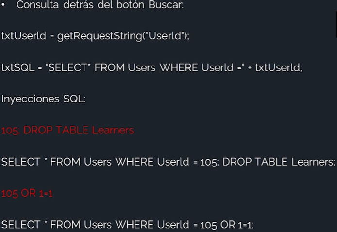
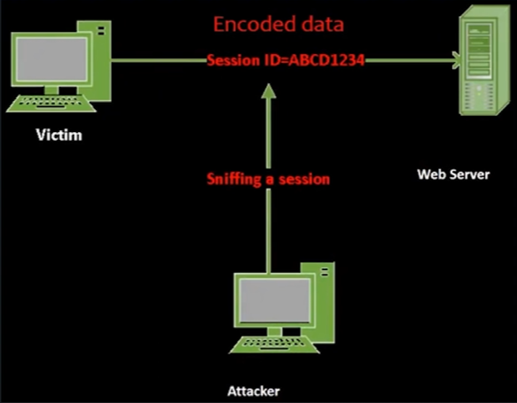
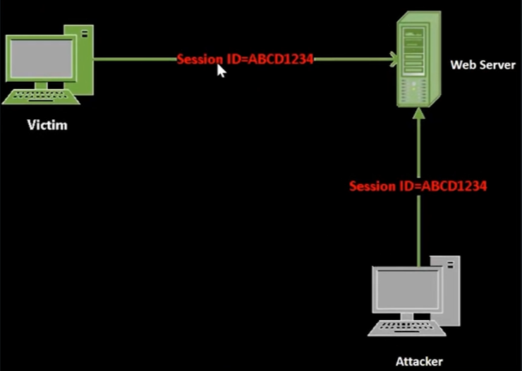
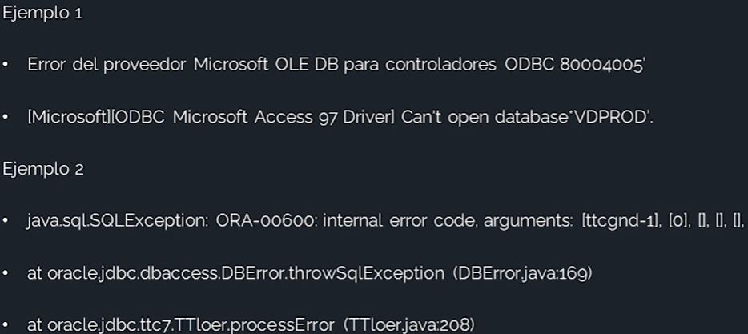
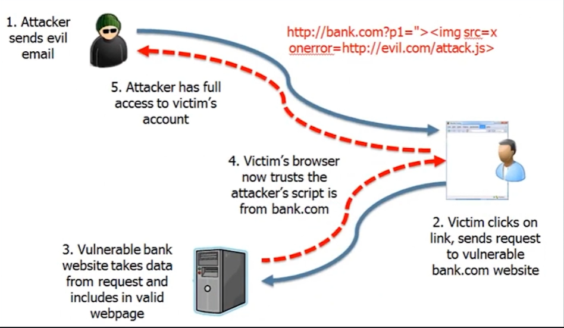
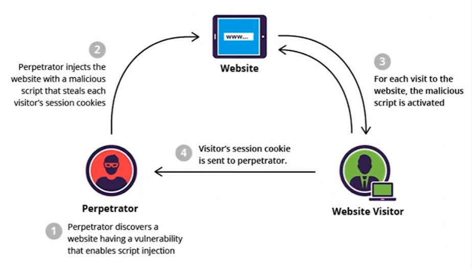

## FORMAS DE ATACAR UNA APLICACIÓN WEB

Las aplicaciones web son extremadamente atractivas para los hackers por muchas razones diferentes especialmente cuando estas aplicaciones web están mal administrados y no parcheadas, convirtiéndose en muy fáciles objetivos a atacar, las fallas de seguridad a un alto nivel pueden ser:

- **No determinar de antemano los requisitos de seguridad** - Esto se refiere a no considerar la seguridad desde el principio del desarrollo de la aplicación web. Por ejemplo, si un equipo de desarrollo no identifica los posibles riesgos de seguridad durante la fase de planificación, es más probable que la aplicación resultante sea vulnerable a ataques.

- **Creación de diseños conceptuales con errores lógicos** - Esto implica diseñar la aplicación web con defectos lógicos que podrían ser explotados por un atacante para comprometer la seguridad. Por ejemplo, un diseño conceptual defectuoso podría permitir a un usuario acceder a funciones o datos sensibles sin la debida autorización.

- **Utilizar prácticas de codificación deficientes que introducen vulnerabilidades técnicas** - Se refiere a escribir código de forma descuidada o sin seguir buenas prácticas de seguridad, lo que puede introducir vulnerabilidades en la aplicación. Por ejemplo, el uso de funciones de entrada de usuario no validadas podría conducir a vulnerabilidades de inyección de código, como SQL injection o XSS (Cross-Site Scripting).

- **Implementación incorrecta de software** - Esto ocurre cuando el código desarrollado no se implementa correctamente en el entorno de producción. Por ejemplo, si las configuraciones del servidor no se ajustan adecuadamente para mitigar riesgos conocidos de seguridad, como la falta de actualizaciones de software o la configuración incorrecta de permisos de archivos y directorios, la aplicación puede ser vulnerable a ataques.

- **Introducción de fallos durante el mantenimiento o la actualización** - Incluso después de que una aplicación web haya sido desarrollada e implementada con éxito, seguirá siendo vulnerable si no se aplican correctamente las actualizaciones de seguridad o si se introducen nuevos errores durante el mantenimiento. Por ejemplo, si una actualización de software no se instala correctamente o introduce nuevas vulnerabilidades, la seguridad de la aplicación puede verse comprometida.

## **OWASP TOP 10**

- **Broken Access Control (Control de acceso roto):** Se refiere a la incapacidad de una aplicación para aplicar restricciones de acceso adecuadas, lo que permite a los usuarios no autorizados acceder a recursos protegidos o realizar acciones que no deberían poder realizar.
- **Cryptographic Failures (Fallos criptográficos)**: Esta categoría aborda los errores en la implementación de la criptografía, incluidos el uso de algoritmos débiles o inseguros, el almacenamiento inadecuado de claves criptográficas y la falta de protección adecuada para datos sensibles. Los fallos criptográficos pueden conducir a la exposición de datos confidenciales, como contraseñas o información financiera, y comprometer la integridad y la autenticidad de los datos transmitidos o almacenados.
- **Injection (Inyecciones):** Las vulnerabilidades de inyección ocurren cuando datos no confiables se incorporan directamente en comandos o consultas de manera insegura. Esto puede conducir a la ejecución de comandos no deseados o al acceso no autorizado a la base de datos. Ejemplos comunes incluyen SQL injection, LDAP injection y XPath injection.
- **Insecure Design (Diseño inseguro)**: Esta categoría se refiere a errores en el diseño arquitectónico de una aplicación que pueden resultar en vulnerabilidades de seguridad. Estos errores pueden incluir la falta de controles de seguridad adecuados, la mala gestión de privilegios, la exposición innecesaria de funcionalidades sensibles o la falta de separación adecuada entre componentes de la aplicación.
- **Security Misconfiguration (Configuración de seguridad incorrecta)**: Ocurre cuando una aplicación o servidor está configurado de manera incorrecta, dejando expuestos datos sensibles o funcionalidades críticas. Esto puede incluir permisos de archivo inseguros, configuraciones predeterminadas no seguras o servicios innecesarios habilitados.
- **Vulnerable and Outdated Components (Componentes obsoletos y vulnerables)**: Esta categoría se refiere al uso de bibliotecas, frameworks o componentes de terceros en una aplicación web que contienen vulnerabilidades conocidas o que no han sido actualizados con regularidad. Estos componentes pueden ser una fuente significativa de riesgo de seguridad si no se aplican parches o actualizaciones de seguridad para abordar las vulnerabilidades conocidas.

### VULNERABILIDADES DE INYECCION

Siempre que haya entrada de texto, entrada de usuario, campo de contraseña, de comentarios, etc existe el riesgo que se produzca un ataque por inyección, en particular la inyección SQL son habituales en las aplicaciones web, esta se produce cuando los datos suministrados por el usuario se envían a un intérprete (lado del servidor) como parte de un comando o consulta.

Los datos hostiles del atacante engañan al interprete para que ejecute comandos no deseados o cambie datos, de esta forma puede controlar la base de datos desde la aplicación. Esto se produce cuando una aplicación web solicita al usuario una entrada.

¿Qué se inyecta?

- Consultas SQL
- Consultas PHP
- Consultas LDAP
- Consultas OS (Uso de llamadas al sistema para realizar a su vez llamadas al sistema operativo)

Cualquier aplicación Web que dependa del uso de un intérprete tiene el potencial de ser víctima de este tipo de fallo.

EJEMPLO (Búsqueda por ID)

¿COMO PROTEGERSE?

- Realizar revisiones del diseño y del código de las bibliotecas reutilizables para garantizar la seguridad
- Validación de entradas y datos
- Uso de APIs seguras y consultas parametrizadas
- Ejecutar comandos con privilegios mínimos

[PRACTICA INYECCION SQL](../laboratorio/vulnerar-sitioweb.md)

### VULNERABILIDADES EN LA EXPOSICION DE DATOS SENSIBLES

Las aplicaciones pueden filtrar involuntariamente información sobre su configuración, funcionamiento interno, o violar la privacidad a través de una variedad de problemas de aplicación para luego los atacantes utilizar esta debilidad para robar datos sensibles o llevar a cabo ataques más graves.

Los algoritmos criptográficos débiles son susceptibles de ataques y revelan datos sensibles.
  

¿COMO PROTEGERSE?

- Evitar la visualización de mensajes de error internos detallados, incluyendo trazas de pila, mensajes con nombres de bases de datos o tablas, protocolos y otros códigos de error. (Esto puede proporcionar a los atacantes pistas sobre posibles fallos)
- Proporcionar mensajes de error breves al usuario mientras se registra información detallada de errores en un archivo de registro interno.
- Cifrar todos los datos en tránsito y en reposo.
- Utilice protocolos y algoritmos seguros.
- Desactivar el almacenamiento en cache de respuestas con datos sensibles.

### VULNERABILIDADES DE LAS ENTIDADES EXTERNAS XML (XXE)

Una aplicación es vulnerable a ataques XXE si permite a los usuarios cargar un XML malicioso que explote el código vulnerable.

Esto se puede utilizar para ejecutar código, robar datos y realizar otras tareas maliciosas.

Un ataque de XML External Entity (XXE) es una vulnerabilidad de seguridad que afecta a aplicaciones web que procesan datos XML. En un ataque XXE, un atacante aprovecha la capacidad de una aplicación para procesar entradas XML externas no confiables y maliciosas que pueden conducir a una variedad de problemas de seguridad, incluida la revelación de información confidencial, la ejecución remota de código y la denegación de servicio (DoS).

Los datos **XML** (Extensible Markup Language) son un formato de datos que se utiliza para estructurar y organizar la información de manera jerárquica mediante etiquetas que describen el contenido de los datos. XML es un lenguaje de marcado similar a HTML, pero está diseñado para ser más flexible y extensible.

En XML, los datos se organizan en elementos, que están delimitados por etiquetas de apertura y cierre. Cada elemento puede contener texto, otros elementos o atributos que describen características específicas del elemento. Por ejemplo:

En este ejemplo, &lt;libro&gt;, &lt;titulo&gt;, &lt;autor&gt; y &lt;publicación&gt; son elementos, y el texto dentro de las etiquetas representa los datos asociados a cada elemento.

XML se utiliza ampliamente para intercambiar datos entre sistemas y aplicaciones, ya que es legible tanto por humanos como por máquinas, y su estructura flexible permite definir formatos de datos personalizados para una amplia variedad de casos de uso.

¿COMO PROTEGERSE?

- Evitar la serialización de datos sensibles
- Implementar un enfoque de listas blancas en el lado del servidor para evitar la carga de XML maliciosos
- Uso de WAF para detectar y bloquear XXE
- Revisión de código

### VULNERABILIDADES EN EL CONTROL DE ACCESO

Se refieren a cualquier intento de un individuo o un sistema de obtener acceso no autorizado a recursos o datos protegidos. Esto puede incluir intentos de acceso a sistemas informáticos, redes, bases de datos, aplicaciones web u otros recursos que contienen información confidencial o sensible.

¿COMO PROTEGERSE?

- **Autenticación sólida**: Utilizar métodos robustos de autenticación, como contraseñas seguras y autenticación multifactor (MFA).
- **Autorización adecuada**: Establecer políticas claras de autorización para determinar quién tiene acceso a qué recursos y en qué capacidades.
- **Principio de privilegio mínimo**: Otorgar a los usuarios solo los privilegios mínimos necesarios para realizar sus funciones, reduciendo así el riesgo de acceso no autorizado a datos sensibles.
- **Monitoreo y registro**: Implementar sistemas de monitoreo y registro para detectar y responder rápidamente a actividades sospechosas o no autorizadas.
- Invalidar tokens y cookies tras el cierre de sesión.

### VULNERABILIDADES EN LA CONFIGURACION DE SEGURIDAD

Las vulnerabilidades en la configuración de seguridad pueden surgir cuando no se siguen los requisitos de seguridad en los servidores, lo que puede exponerlos a riesgos y amenazas cibernéticas.

Esto puede suceder cuando los administradores de sistemas no aplican las mejores prácticas de seguridad, como configurar adecuadamente los cortafuegos, mantener actualizados los sistemas y aplicaciones con los últimos parches de seguridad, y asegurarse de que se utilicen contraseñas fuertes y se implemente la autenticación multifactor (MFA) cuando sea posible.

Se considera una mala configuración de seguridad cuando:

- No se siguen los requisitos de seguridad en los servidores
- No se aplican las mejores practicas
- Favorecer la practicidad sobre la seguridad

¿COMO PROTEGERSE?

- Siga un proceso de refuerzo tanto para el hardware como para las aplicaciones
- Asegúrese de que se modifiquen los valores por defecto
- Instale solo las funciones necesarias de un marco de trabajo
- Revise la seguridad de las configuraciones a intervalos fijos

### VULNERABILIDADES DE CROSS SITE SCRIPTING (XSS)

XSS, o Cross-Site Scripting, permite a los atacantes inyectar scripts del lado del cliente en páginas web legítimas vulnerables vistas por otros usuarios. Este tipo de ataque puede ser utilizado para robar cookies de sesión, realizar phishing, redirigir a usuarios a sitios maliciosos o incluso defacing de sitios web. El objetivo del ataque confía en la aplicación web y, por lo tanto, los ataques XSS explotan esa confianza para ejecutar acciones maliciosas que normalmente no estarían permitidas.

Es fundamental para los desarrolladores implementar medidas de seguridad, como la validación y el escape de datos de entrada, para mitigar el riesgo de ataques XSS y proteger la integridad y la confidencialidad de los datos del usuario.

#### CATEGORIAS DE ATAQUES XSS

- **Reflejados (no persistentes)**
    - Los ataques reflejados llegan a la víctima por otra vía (a través de un mensaje de correo electrónico o rebotados desde otro servidor)
    - El ataque suele adoptar la forma de una etiqueta HTML (a menudo el hipervínculo) que contiene secuencias de comandos maliciosas (a menudo JavaScript)
    - Suele realizarse cuando existe una ubicación en la que se puede introducir contenido arbitrario (como un mensaje de correo electrónico o un campo de texto libre, por ejemplo) y a continuación, el objetivo del ataque hace referencia a él.
  
  
- **Almacenado(persistente)**
    - El código inyectado se almacena de forma permanente en la aplicación web, como en una base de datos, un foro de mensajes, un registro de comentarios o un perfil de usuario.
    - Cuando un usuario accede a la página comprometida, el script malicioso se ejecuta automáticamente, lo que puede tener consecuencias graves, como robo de sesiones, modificación de contenido o redirección a sitios maliciosos.
    - Este tipo de ataque puede ser más peligroso que los ataques reflejados, ya que el código malicioso permanece activo y puede afectar a múltiples usuarios durante un período prolongado de tiempo.
  

¿COMO PROTEGERSE?

- Se recomienda filtrar/sanitizar la entrada de datos en la medida de lo posible (es posible que algunos datos deban permitir caracteres especiales)
- Filtrar la salida convirtiendo el texto o los datos que puedan contener caracteres HTML peligrosos a su formato codificado:
    - " a &quot;
    - < a &lt;
    - \> a &gt;
- Utilizar marcos de trabajo en lugar de codificar desde cero. Existen marcos de trabajo como OWASP AntiSamy que pueden ayudar a proteger contra XSS.
- Implementar una Política de seguridad de contenidos (CSP). Una CSP puede ayudar a prevenir ataques XSS al especificar qué scripts se pueden ejecutar en una página web.

### VULNERABILIDADES DE DESERIALIZACION INSEGURAS

Algunas de las aplicaciones guardan datos del lado del cliente utilizando objetos serializados, estas aplicaciones confían en el cliente para mantener el estado, pero permitirán la manipulación de datos serializados, ejemplo:

Alteración de los objetos serializados en las cookies para escalada de privilegios

¿COMO PROTEGERSE?

- Cifrado de los datos serializados

### USO DE COMPONENTES CON VULNERABILIDADES CONOCIDAS

Si la aplicación utiliza algún componente con vulnerabilidades conocidas esto puede conducir a problemas de seguridad, violaciones de seguridad e incluso la toma del control del servidor, estos componentes pueden ser Marcos, bibliotecas y funciones vulnerables.

EJEMPLOS DE USO DE COMPONENTES CON VULNERABILIDADES CONOCIDAS

- Uso de una versión vulnerable de PHP
- Versión de kernel obsoleta
- Servidor Windows sin parches
- Versión de Query vulnerable

¿COMO PROTEGERSE?

- Establecer y seguir un proceso regular de aplicación de parches
- Suscribirse a foros de seguridad relevantes (CVE/Fixes) para mantenerse actualizado

### VULNERABILIDADES DE REGISTRO Y MONITORIZACION INSUFICIENTES

Con todas las contramedidas existentes los ataques aun así pueden acceder y esto solo se nota después de que ha ocurrido un incidente. Se dice que en promedio la mayoría de los ataques tardan 200 días en descubrirse y si no se detecta el atacante podría haber comprometido el sistema hace mucho tiempo, para asegurarse de que se note la intención maliciosa del atacante es esencial registrar y monitorear todas las actividades.

Es esencial registrar toda la actividad y monitorearla en búsqueda de cualquier comportamiento sospechoso.

ALGUNOS EJEMPLOS:

- Demasiados intentos de inicio de sesión fallidos desde una fuente en particular
- Demasiadas peticiones desde una fuente en particular a un ritmo extremadamente rápido/lento/fijo podría ser un intento de DOS. Compruebe y actúe
- Trafico basura
- Picos en el patrón de tráfico cuando no se esperan
- Consultas DNS extensas

¿COMO PROTEGERSE?

- Supervisión 24/7 del tráfico de aplicaciones y análisis de registros
- Implantación y puesta en práctica de procedimientos eficaces de respuesta a incidentes de seguridad.

### RIESGOS ADICIONALES A TENER EN CUENTA

- **Falsificación de petición en sitios cruzados**

CSRF es una vulnerabilidad que permite a un atacante inducir a un usuario a realizar acciones no deseadas en una aplicación web en la que el usuario está autenticado. El atacante puede crear una solicitud HTTP maliciosa y engañar al usuario para que la ejecute, aprovechando la sesión activa del usuario en la aplicación. Esto puede llevar a acciones no autorizadas, como cambiar la contraseña, realizar transacciones financieras o eliminar datos.

- **Carga ilimitada de archivos de tipo peligroso**

Esta vulnerabilidad se produce cuando una aplicación web permite la carga de archivos sin restricciones adecuadas, lo que puede resultar en la carga de archivos maliciosos, como scripts, ejecutables o archivos infectados con malware. Esto puede ser explotado por un atacante para ejecutar código malicioso en el servidor o comprometer la seguridad de otros usuarios.

- **Secuestro de clics**

El secuestro de clics, también conocido como "Clickjacking", es una técnica utilizada por los atacantes para engañar a los usuarios y hacer que hagan clic en elementos de una página web sin su conocimiento o consentimiento. Esto se logra superponiendo elementos transparentes o invisibles sobre elementos legítimos de la página web, de modo que cuando un usuario hace clic en lo que parece ser un elemento legítimo, en realidad está haciendo clic en otro elemento oculto. Esta técnica puede ser utilizada para dirigir a los usuarios a sitios maliciosos, realizar acciones no deseadas o robar información confidencial.

## DESCUBRIR VULNERABILIDADES EN SITIOS WEB

Antes de realizar cualquier prueba de penetración en un sitio web, es sabio comenzar con un escaneo exhaustivo del mismo para descubrir posibles vulnerabilidades y puntos débiles en la seguridad. Esto puede incluir el uso de herramientas automatizadas de escaneo de vulnerabilidades, como escáneres de seguridad web, que pueden identificar vulnerabilidades comunes, como inyecciones SQL, XSS, CSRF, archivos y directorios expuestos, entre otros.

Además, es importante realizar una evaluación manual de la seguridad del sitio web, revisando el código fuente, las configuraciones del servidor, los archivos de configuración y otras áreas que puedan ser susceptibles a ataques. Esto puede ayudar a identificar vulnerabilidades específicas y personalizadas que pueden no ser detectadas por herramientas automatizadas.

## CONTROL DEL SERVIDOR DE BASES DE DATOS CON SQLMAP

SQLMap es una herramienta poderosa que automatiza el proceso de detectar y explotar flujos de inyección SQL en sitios web. Su objetivo principal es permitir a los usuarios tomar el control del servidor de la base de datos subyacente.

Una de las características destacadas de SQLMap es su motor de detección altamente eficaz, que puede identificar vulnerabilidades de inyección SQL de manera rápida y precisa. Esto les permite a los usuarios realizar pruebas exhaustivas en sitios web en busca de posibles vulnerabilidades de seguridad.

Además de su motor de detección avanzado, SQLMap cuenta con una amplia gama de interruptores y opciones que brindan flexibilidad y control a los usuarios durante el proceso de análisis y explotación. Estos interruptores permiten ajustar el comportamiento de la herramienta según las necesidades específicas del usuario y las características del sitio web objetivo.

